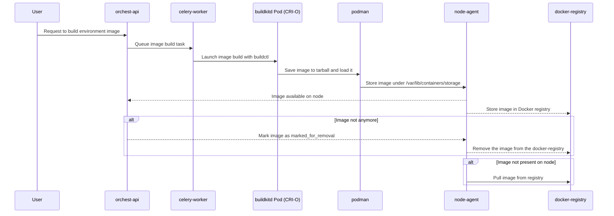

# ADR-001: Add CRI-O Runtime Support in Orchest

## Status

Accepted

## Context

Orchest is a data platform built to run on Kubernetes, enabling data scientists and developers to define, run, and manage workflows in containerized environments. A core feature of Orchest is its **Environments** system, which allows users to define custom runtime environments. These environments are built as Docker images using BuildKit and later used during pipeline execution.

Historically, Orchest supported environments on clusters using `docker` and `containerd` runtimes. However, compatibility issues were identified when trying to run Orchest on clusters using the `cri-o` runtime—commonly found in enterprise Kubernetes platforms such as Oracle Kubernetes Engine.

To ensure Orchest can be deployed across all major Kubernetes runtimes, we implemented full support for `cri-o`. This involved key changes in the controller, API, build infrastructure, and runtime agents.

---

**Validation of CRI-O Support**:

* `orchest-controller/pkg/controller/orchestcluster/cluster_utils.go` updated to detect `cri-o` by inspecting the `containerRuntimeVersion` field on Kubernetes nodes. This field is accessed via the Kubernetes API using `node.Status.NodeInfo.ContainerRuntimeVersion`, which usually contains values like `containerd://1.6.4`, `docker://20.10.8`, or `cri-o://1.23.0`. Orchest parses this string by splitting on the `://` delimiter to extract the runtime name (`containerd`, `docker`, or `cri-o`). This extracted runtime name determines the appropriate default socket path for communication with the container runtime and informs logic across the system to adjust behavior for that runtime.
* `orchest-controller/pkg/controller/orchestcluster/cluster_controller.go` updated to allow `buildkit-daemon` deployment when the runtime is CRI-O.

2. **BuildKit Daemonset for CRI-O**:

   * New function `getBuildKitDaemonCrioDaemonset` in `buildkit_daemon.go` generates a CRI-O specific DaemonSet using `oci-worker`. This worker mode is required because CRI-O is not compatible with containerd workers. The function ensures the correct container runtime socket (`/var/run/crio/crio.sock`) and the container storage path (`/var/lib/containers/storage`) are mounted. These mounts are essential for both BuildKit operations and for enabling the `node-agent` (running in a different pod) to access the images built within the CRI-O build pod. This setup also ensures readiness and liveness probes for the buildkitd service work consistently across runtimes.

3. **Manifests Adaptation**:

   * `orchest-api/app/core/image_utils.py` extended with CRI-O-specific logic to correctly configure volume mounts and manifest content for image building. This included defining dedicated mounts for the BuildKit socket and CRI-O's storage directory (`/var/lib/containers/storage`). These updates ensure that when the image is built and loaded via `podman` (as required by CRI-O), the resulting image remains accessible to the `node-agent` on a separate pod. Moreover, manifest generation logic was adapted to include necessary `--opt` flags and argument formatting specific to CRI-O's OCI worker mode, maintaining compatibility across container runtimes.

4. **Image Output Handling**:

   * Unlike `containerd`, CRI-O does not support containerd workers within BuildKit. To maintain compatibility and avoid significant changes in `node-agent`, the chosen strategy was to use BuildKit's `--output type=docker,...` option to save the built image as a tarball.
   * This tarball is then loaded using `podman`, a tool that works well with CRI-O storage layers.
   * Using the `push=true` option (which pushes the image directly to a registry) would have required architectural changes to the `node-agent`, which currently checks image availability and manages lifecycle within the registry.
   * Keeping image lifecycle responsibility with `node-agent` ensures consistent logic across runtimes and avoids potential race conditions.
   * To support CRI-O, we needed a tool that could load Docker-formatted images into the container storage used by CRI-O. `podman` was chosen due to its compatibility with the CRI-O runtime. However, using podman introduced two challenges:

     * Older versions had a bug affecting the image naming when loading tarballs ([podman#12560](https://github.com/containers/podman/issues/12560)).
     * Newer versions (above 4.9.0) crash with segmentation faults when `/var/lib/containers/storage` is mounted into the pod. However, mounting this volume was necessary because the images loaded with podman need to be accessible by the node-agent, which runs in a separate pod and relies on accessing this shared storage path.
   * To resolve both issues, we updated the Alpine package source to access newer packages and explicitly pinned `podman` to version 4.5.1, the latest stable version that avoids both limitations.

5. **Runtime Abstraction**:

   * `node-agent/app/container_runtime.py` updated to use `crictl` when `RuntimeType.Crio` is detected.

6. **Environment Variable Overrides**:

   * `orchest-api/app/config.py` updated to support runtime-specific image builder configuration by reading the environment variables `DOCKER_IMAGE_BUILDER_IMAGE`, `CONTAINERD_IMAGE_BUILDER_IMAGE`, and `CRIO_IMAGE_BUILDER_IMAGE`. If these are unset, the system falls back to the default values pointing to `docker.io/orchest/...`. This approach allows users to override the image builder container used for each runtime independently, providing flexibility for enterprise environments or air-gapped deployments, without requiring significant structural changes to propagate such overrides from the OrchestCluster specification to downstream components like `orchest-api` or `celery-worker`.

## Consequences

* **Pros**:

  * Orchest now supports clusters running CRI-O.
  * User-customizable image builder pipelines.
  * Transparent runtime abstraction across Docker, containerd, and CRI-O.

* **Cons**:

  * Increased complexity in the deployment and environment configuration.
  * More runtime-specific code and logic scattered across services.

## Communication Flow for CRI-O Image Build

## Related Commits / PRs

See [diff.txt](./diff.txt) for the detailed changes made across the services.

## Authors

* Engineering Team at Dadosfera

## Date

2025-05-07
